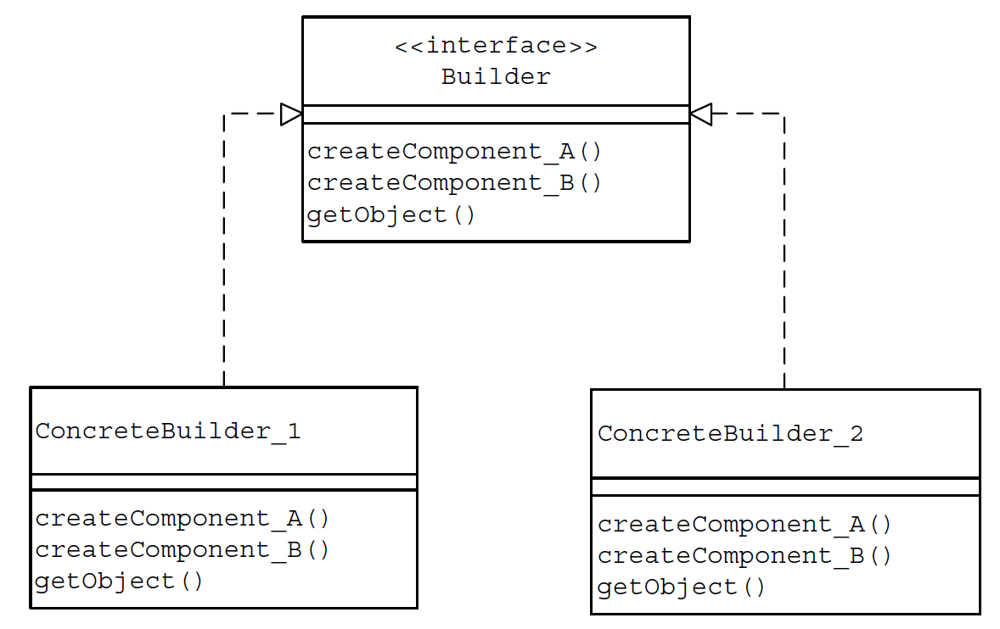
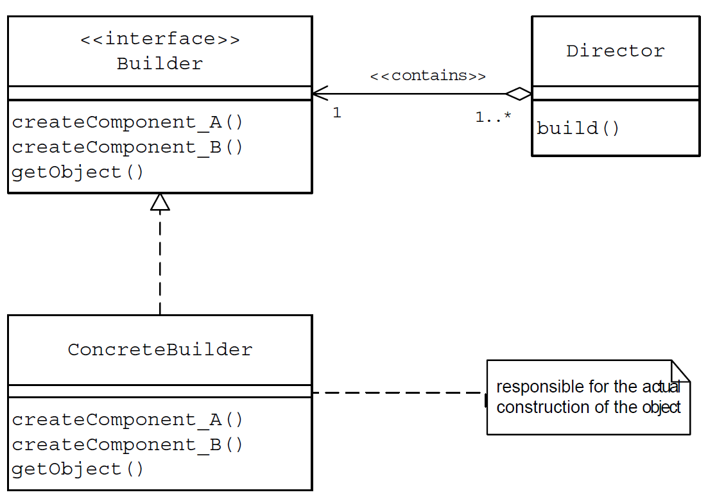
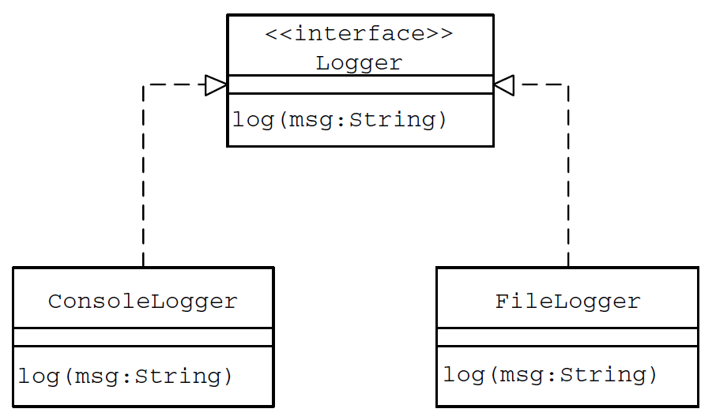
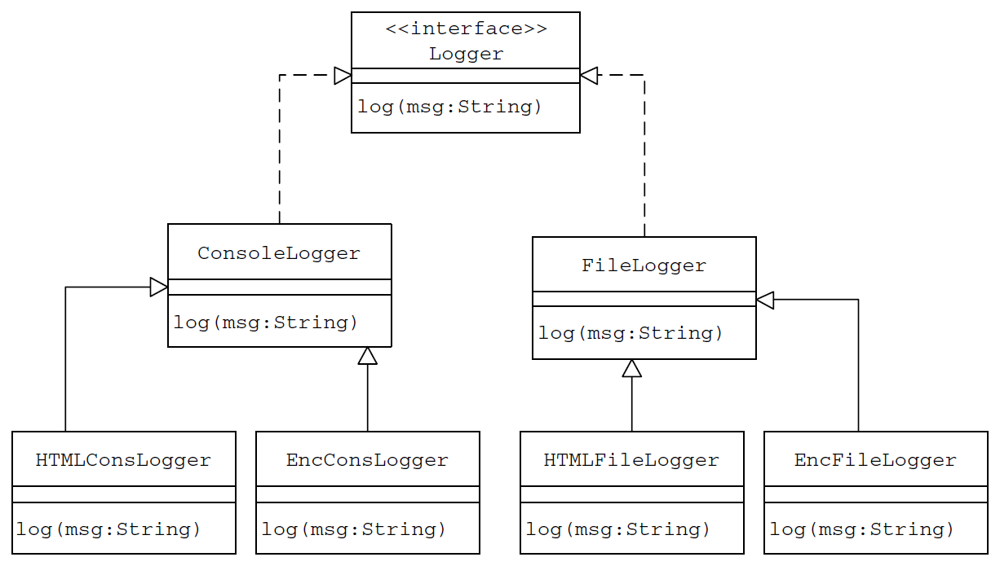
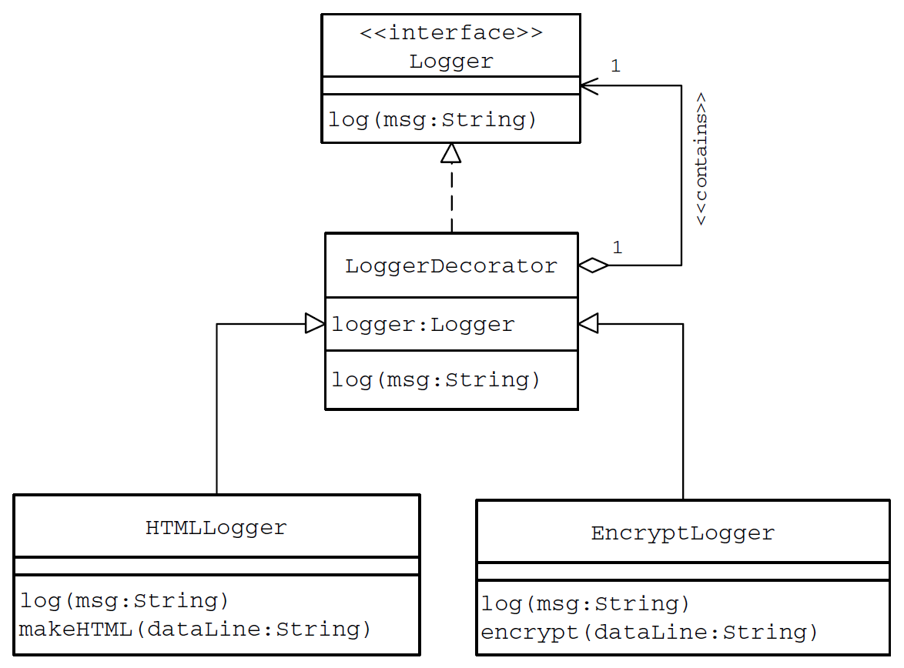

# Design Patterns

History (late 1970s): The similarities between the different structures that were designed to solve the same problem
that were of high quality is termed as a `pattern` or `architectural pattern`.
The patterns identified and documented were purely architectural and deal with structures like buildings, gardens and
roadways.

A design pattern is a documented best practice or a solution that has
been applied successfully in multiple environments to solve a problem that recurs
in a specific set of situations.
In architectural pattern, Christopher Alexander describes a pattern as “a recurring solution to
a common problem in a given context and system of forces.”

- Context refers to the set of conditions/situations in which a given pattern is applicable
- System of forces refers to the set of constraints that occur in the specific context

## Basic Patterns

The most common, and basic important design patterns in object-oriented design and
programming are `interface`, `abstract class`, `private methods`, `accessor methods`, `constant data manager`,
`ìmmutable object` and `monitor`.

## Creational Patterns

Creational design patterns abstract object instantiation process and help make a system
independent of how its dependency objects are created, composed, and represented. The system at large knows about the
objects is their
interfaces as defined by abstract classes. A `class creational
pattern` uses inheritance to vary the class that's instantiated, whereas an `object creational
pattern` will delegate instantiation to another object.

Creational patterns become important as systems evolve to depend more on `object
composition` than `class inheritance`. Creational patterns give flexibility in what gets created, who creates it, how it
gets created, and when.

### Factory Method

Factory Method pattern recommends encapsulating the
functionality required, to select and instantiate an appropriate class, inside a
designated method referred to as a `factory method`. Factory method is used when a system depends more on
`class inheritance`. Thus, a factory method can
be defined as a method in a class that:

- Selects an appropriate class from a class hierarchy based on the application
  context and other influencing factors
- Instantiates the selected class and returns it as an instance of the parent
  class type

Encapsulation of the required implementation to select and instantiate an
appropriate class in a separate method has the following advantages:

- Application objects use the factory method to get access to
  the appropriate class instance.
- The factory method separates and hides the details of selection and instantiation from the application
  objects.
  

### Abstract Factory

Abstract factory provides an interface for creating families of related or dependent objects without specifying
their concrete classes.

Factory Method is specifying a method for the creation of an object, thus
allowing subclasses or implementing classes to define the concrete object. Abstract
Factories are usually implemented using the Factory Method pattern. Another
approach would be to use the Prototype pattern.

Let assume we have `"widgets"` like `scroll bars`, `windows`, `checkbox` and `buttons`. To be portable
across look-and-feel standards such as for Windows, macOS and Ubuntu, an application should not hard-code its widgets
for a
particular look and feel. Instantiating look-and-feel-specific classes of widgets throughout the
application makes it hard to change the look and feel later. We can solve this problem by defining an
`abstract WidgetFactory class` that declares an interface for creating each basic kind of widget. There's also an `abstract class for each kind
of widget such as button, checkbox, sroll bar and window`, and `concrete subclasses` implement widgets for specific
look-and-feel standards such as
`Windows, macOS, Ubuntu`. WidgetFactory's
interface
has an operation that returns a new widget object for each abstract
widget class. Clients call these operations to obtain widget instances, but clients aren't aware
of the concrete classes they're using. Thus, clients stay independent of the prevailing look
and feel.
Use the Abstract Factory pattern when:

- a system should be independent of how its products are created, composed, and
  represented.
- a system should be configured with one of multiple families of products.
- a family of related product objects is designed to be used together, and you need to
  enforce this constraint.
- you want to provide a class library of products, and you want to reveal just their
  interfaces, not their implementations.

### Singleton

In a singleton pattern, a class only has one instance, and provide a global point of access to it.
The class itself responsible for keeping track of its sole instance.
The class can ensure that no other instance can be created (by intercepting requests to
create new objects), and it can provide a way to access the instance. This is the Singleton
pattern.

### Prototype

Prototype pattern specifies the kinds of objects to create using a prototypical instance, and create new objects
by copying this prototype.
In Prototype pattern we:

- Create one object upfront and designate it as a prototype object.
- Create other objects by simply making a copy of the prototype object and making required modifications.

#### Shallow Copy Versus Deep Copy

When an object is cloned as a shallow copy:

- The original top-level object and all of its primitive members are duplicated.
- Any lower-level objects that the top-level object contains are not duplicated.
  Only references to these objects are copied. This results in both the original
  and the cloned object referring to the same copy of the lower-level object.

When an object is cloned as a deep copy:

- The original top-level object and all of its primitive members are duplicated.
- Any lower-level objects that the top-level object contains are also duplicated.
  In this case, both the original and the cloned object refer to two different lower-level objects. The lower-level
  object is duplicated and is not shared by
  both the original and the cloned top-level objects.

### Builder

In general, object construction details such as instantiating and initializing the
components that make up the object are kept within the object, often as part of
its constructor. This approach is suitable as long as the object under construction is simple and the object
construction process is definite and always produces the same representation of the object.

The `Builder` pattern suggests moving the construction logic out of the object class to a separate class referred to as
a `builder` class. There can be more than one such builder class each with different implementation
for the series of steps to construct the object. Each such builder implementation
results in a different representation of the object. The object construction process becomes independent of the
components that make up the object. Each of the different steps in the construction process
can be declared as methods of a common interface to be implemented by different
concrete builders.

*Builder Class Hierarchy*

The Builder pattern introduces another level of separation called `Director`. Instead of having client objects invoke
different builder methods directly, the Builder pattern suggests using a dedicated object referred to as a `Director` ,
which is responsible for invoking different builder methods required for the construction of the final object. Different
client objects
can make use of the Director object to create the required object. Once the object
is constructed, the client object can directly request from the builder the fully
constructed object. To facilitate this process, a new method `getObject` can be
declared in the common Builder interface to be implemented by different concrete
builders.

*Builder class association*

The interaction between the client object, the Director and the Builder objects
can be summarized as follows:

- The client object creates instances of an appropriate concrete Builder
  implementer and the Director. The client may use a factory for creating an appropriate Builder object.
  ```Java 
  Director director = new Director(); CarBuilder builder = new CarBuilder();
  ```
- The client associates the Builder object with the Director object.
- The client invokes the build method on the Director instance to begin the object creation process. Internally, the
  Director invokes different Builder methods required to construct the final object.
  ```Java 
  director.constructSportsCar(builder);
  ```
- Once the object creation is completed, the client invokes the getObject method on the concrete Builder instance to get
  the newly created object.

A builder pattern separates the construction of a complex object from its representation so that the same
construction process can create different representations. The Builder pattern suggests moving the construction logic
out of the object class to a separate class referred to as a builder class.

Use the Builder pattern when:

- the algorithm for creating a complex object should be independent of the parts that
  make up the object and how they're assembled.
- the construction process must allow different representations for the object that's
  constructed.

#### Participants

**Builder**

- specifies an abstract interface for creating parts of a Product object.
- defines all possible ways to build a product
- Example:

```Java
createComponent_A();

createComponent_B();

getObject();
```

**ConcreteBuilder**

- constructs and assembles parts of the product by implementing the Builder
  interface.
- defines and keeps track of the representation it creates.
  provides an interface for retrieving the product

**Director**

- constructs a final object using the Builder interface.
- responsible for invoking different builder methods required for the construction of the final object.

**Product**

- represents the complex object under construction. ConcreteBuilder builds
  the product's internal representation and defines the process by which it's
  assembled.
- includes classes that define the constituent parts, including interfaces for
  assembling the parts into the final result.

Example 1
A typical online job site maintains employer-, candidate- and jobs-related data.
Let us build an application using the Builder pattern that displays the necessary
user interface to allow a user to search for different employers and candidates in
the database.

- Employer Search
    - Name
    - City
    - Membership Renewal Date
- Candidate Search
    - Name
    - Experience (minimum number of years)
    - Skill Set

The required user interface (UI) for each of these searches requires a different combination of UI controls. In terms of
implementation, the required set of UI
controls can be placed in a JPanel container. The Builder pattern can be used in this case with different builder
objects constructing the JPanel object with
the necessary UI controls and initializing them appropriately.

## Structural Patterns

Structural patterns primarily:

- Deal with objects delegating responsibilities to other objects. This results in a layered architecture of components
  with low degree of coupling.
- Facilitate interobject communication when one object is not accessible to the other by normal means or when an object
  is not usable because of
  its incompatible interface.

### Decorator

The Decorator Pattern is used to extend the functionality of an object dynamically
without having to change the original class source or using inheritance. This is
accomplished by creating an object wrapper referred to as a Decorator around
the actual object.

- The Decorator object is designed to have the same interface as the underlying object. This allows a client object to
  interact with the Decorator
  object in exactly the same manner as it would with the underlying actual object.
- The Decorator object contains a reference to the actual object.
- The Decorator object receives all requests (calls) from a client. It in turn forwards these calls to the underlying
  object.
- The Decorator object adds some additional functionality before or after forwarding requests to the underlying object.
  This ensures that the additional
  functionality can be added to a given object externally at runtime without modifying its structure.

| Decorator Pattern                                                                                                                                                               | Inheritance                                                                                                                                                         |
|---------------------------------------------------------------------------------------------------------------------------------------------------------------------------------|---------------------------------------------------------------------------------------------------------------------------------------------------------------------|
| Used to extend the functionality of a particular object.                                                                                                                        | Used to extend the functionality of a class of objects.                                                                                                             |
| Does not require subclassing.                                                                                                                                                   | Requires subclassing.                                                                                                                                               |
| Dynamic                                                                                                                                                                         | Static                                                                                                                                                              |
| Runtime assignment of responsibilities.                                                                                                                                         | Compile time assignment of responsibilities.                                                                                                                        |
| Prevents the proliferation of subclasses leading to less complexity and confusion.                                                                                              | Could lead to numerous subclasses, exploding class hierarchy on specific occasions.                                                                                 |
| More flexible                                                                                                                                                                   | Less flexible                                                                                                                                                       |
| Possible to have different decorator objects for a given object simultaneously. A client can choose what capabilities it wants by sending messages to an appropriate decorator. | Having subclasses for all possible combinations of additional capabilities, which clients expect out of a given class, could lead to a proliferation of subclasses. |
| Easy to add any combination of capabilities. The same capability can even be added twice.                                                                                       | Difficult                                                                                                                                                           |


Logger with the following two small features that clients would like to have:

- Transform an incoming message to an HTML document.
- Apply a simple encryption by transposition logic on an incoming message.

Inheritance approach to solve the above requirement would look like as the diagram shown below.

*Class Hierarchy after Applying Inheritance*

The Decorator pattern comes to our rescue in situations like this. The Decorator
pattern recommends having a wrapper around an object to extend its functionality
by object composition rather than by inheritance.
Applying the Decorator pattern, let us define a default root decorator
LoggerDecorator for the message logging utility with the following
characteristics:

- The LoggerDecorator contains a reference to a Logger instance. This
  reference points to a Logger object it wraps.
- The LoggerDecorator implements the Logger interface and provides
  the basic default implementation for the log method, where it simply
  forwards an incoming call to the Logger object it wraps. Every subclass
  of the LoggerDecorator is hence guaranteed to have the log method
  defined in it.

A decorator object must provide the same interface as the object it wraps. When clients
create an instance of the decorator, they interact with the decorator in exactly the
same manner as they would with the original object using the same interface.

*Class Structure after Decorator pattern applied*

In order to log messages using the newly designed decorators a client object needs to:

- Create an appropriate Logger instance (FileLogger/ConsoleLogger) using the LoggerFactory factory method.
- Create an appropriate LoggerDecorator instance by passing the Logger instance created in Step 1 as an argument to its
  constructor.
- Invoke methods on the LoggerDecorator instance as it would on the Logger instance.

### Adapter

Allows the conversion of the interface of a class to another interface that clients expect. This allows
classes with incompatible interfaces to work together.

The Adapter pattern suggests defining a wrapper class around the object with the incompatible
interface. This wrapper object is referred as an `adapter` and the object it wraps
is referred to as an `adaptee`. The adapter provides the required interface expected
by the client. The implementation of the adapter interface converts client requests
into calls to the adaptee class interface.

In other words, when a client calls an adapter method, internally the adapter class calls a method of the adaptee class,
which the client has no knowledge of. This gives the client indirect access to the
adaptee class. Thus, an adapter can be used to make classes work together that
could not otherwise because of incompatible interfaces.

The term interface used in the discussion above:

- Does not refer to the concept of an interface in Java programming language,
  though a class’s interface may be declared using a Java interface.
- Does not refer to the user interface of a typical GUI application consisting
  of windows and GUI controls.
- Does refer to the programming interface that a class exposes, which is
  meant to be used by other classes. As an example, when a class is designed
  as an abstract class or a Java interface, the set of methods declared in it
  makes up the class’s interface.

Adapters can be classified broadly into two categories — class adapters and object
adapters — based on the way a given adapter is designed.

#### Class Adapter

A class adapter is designed by subclassing the adaptee class. In addition, a class
adapter implements the interface expected by the client object. When a client
object invokes a class adapter method, the adapter internally calls an adaptee
method that it inherited.

#### Object Adapter

An object adapter contains a reference to an adaptee object. Similar to a class
adapter, an object adapter also implements the interface, which the client expects.
When a client object calls an object adapter method, the object adapter invokes
an appropriate method on the adaptee instance whose reference it contains.

## Behavioral Patterns

# UML

UML is an application modeling specification from OMG. Using
UML, you can specify, visualize and create artifacts of both software and non-software
systems. UML is a modeling language only — that is,
it defines the words and grammar, but not the process or procedure for creating
models.

UML provides 12 diagrams towards representing an application’s requirements analysis
and solution design. These 12 diagrams are classified into 3 categories
as follows.

## Structure Diagrams

The following four structure diagrams can be used to represent
the static structure of an application.

1. Class diagrams
2. Object diagrams
3. Component diagrams
4. Deployment diagrams

## Behavior Diagrams

The following five behavior diagrams can be used to represent
the dynamic behaviors of an application.

1. Use Case diagrams
2. Sequence diagrams
3. Activity diagrams
4. Collaboration diagrams
5. Statechart diagram

## Model Management Diagrams

The following three model management diagrams can be used
to represent how different application modules are organized and managed.

1. Packages
2. Subsystems
3. Models


