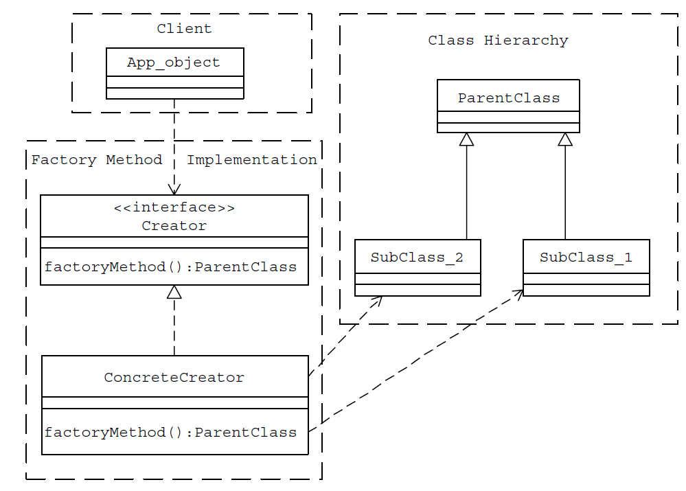

# Design Patterns

History (late 1970s): The similarities between the different structures that were designed to solve the same problem
that were of high quality is termed as a `pattern` or `architectural pattern`.
The patterns identified and documented were purely architectural and deal with structures like buildings, gardens and
roadways.

A design pattern is a documented best practice or a solution that has
been applied successfully in multiple environments to solve a problem that recurs
in a specific set of situations.
In architectural pattern, Christopher Alexander describes a pattern as “a recurring solution to
a common problem in a given context and system of forces.”

- Context refers to the set of conditions/situations in which a given pattern is applicable
- System of forces refers to the set of constraints that occur in the specific context

## Basic Patterns

The most common, and basic important design patterns in object-oriented design and
programming are `interface`, `abstract class`, `private methods`, `accessor methods`, `constant data manager`,
`ìmmutable object` and `monitor`.

## Creational Patterns

Creational design patterns abstract object instantiation process and help make a system
independent of how its dependency objects are created, composed, and represented. The system at large knows about the
objects is their
interfaces as defined by abstract classes. A `class creational
pattern` uses inheritance to vary the class that's instantiated, whereas an `object creational
pattern` will delegate instantiation to another object.

Creational patterns become important as systems evolve to depend more on `object
composition` than `class inheritance`. Creational patterns give flexibility in what gets created, who creates it, how it
gets created, and when.

### Factory Method

Factory Method pattern recommends encapsulating the
functionality required, to select and instantiate an appropriate class, inside a
designated method referred to as a `factory method`. Factory method is used when a system depends more on
`class inheritance`. Thus, a factory method can
be defined as a method in a class that:

- Selects an appropriate class from a class hierarchy based on the application
  context and other influencing factors
- Instantiates the selected class and returns it as an instance of the parent
  class type

Encapsulation of the required implementation to select and instantiate an
appropriate class in a separate method has the following advantages:

- Application objects use the factory method to get access to
  the appropriate class instance.
- The factory method separates and hides the details of selection and instantiation from the application
  objects.
  

### Abstract Factory

Abstract factory provides an interface for creating families of related or dependent objects without specifying
their concrete classes.

Factory Method is specifying a method for the creation of an object, thus
allowing subclasses or implementing classes to define the concrete object. Abstract
Factories are usually implemented using the Factory Method pattern. Another
approach would be to use the Prototype pattern.

Let assume we have `"widgets"` like `scroll bars`, `windows`, `checkbox` and `buttons`. To be portable
across look-and-feel standards such as for Windows, macOS and Ubuntu, an application should not hard-code its widgets
for a
particular look and feel. Instantiating look-and-feel-specific classes of widgets throughout the
application makes it hard to change the look and feel later. We can solve this problem by defining an
`abstract WidgetFactory class` that declares an interface for creating each basic kind of widget. There's also an `abstract class for each kind
of widget such as button, checkbox, sroll bar and window`, and `concrete subclasses` implement widgets for specific
look-and-feel standards such as
`Windows, macOS, Ubuntu`. WidgetFactory's
interface
has an operation that returns a new widget object for each abstract
widget class. Clients call these operations to obtain widget instances, but clients aren't aware
of the concrete classes they're using. Thus, clients stay independent of the prevailing look
and feel.
Use the Abstract Factory pattern when:

- a system should be independent of how its products are created, composed, and
  represented.
- a system should be configured with one of multiple families of products.
- a family of related product objects is designed to be used together, and you need to
  enforce this constraint.
- you want to provide a class library of products, and you want to reveal just their
  interfaces, not their implementations.

### Singleton

In a singleton pattern, a class only has one instance, and provide a global point of access to it.
The class itself responsible for keeping track of its sole instance.
The class can ensure that no other instance can be created (by intercepting requests to
create new objects), and it can provide a way to access the instance. This is the Singleton
pattern.

### Prototype

Prototype pattern specifies the kinds of objects to create using a prototypical instance, and create new objects
by copying this prototype.
In Prototype pattern we:

- Create one object upfront and designate it as a prototype object.
- Create other objects by simply making a copy of the prototype object and making required modifications.

#### Shallow Copy Versus Deep Copy

When an object is cloned as a shallow copy:

- The original top-level object and all of its primitive members are duplicated.
- Any lower-level objects that the top-level object contains are not duplicated.
  Only references to these objects are copied. This results in both the original
  and the cloned object referring to the same copy of the lower-level object.

When an object is cloned as a deep copy:

- The original top-level object and all of its primitive members are duplicated.
- Any lower-level objects that the top-level object contains are also duplicated.
  In this case, both the original and the cloned object refer to two different lower-level objects. The lower-level
  object is duplicated and is not shared by
  both the original and the cloned top-level objects.

## Structural Patterns

## Behavioral Patterns

# UML

UML is an application modeling specification from OMG. Using
UML, you can specify, visualize and create artifacts of both software and non-software
systems. UML is a modeling language only — that is,
it defines the words and grammar, but not the process or procedure for creating
models.

UML provides 12 diagrams towards representing an application’s requirements analysis
and solution design. These 12 diagrams are classified into 3 categories
as follows.

## Structure Diagrams

The following four structure diagrams can be used to represent
the static structure of an application.

1. Class diagrams
2. Object diagrams
3. Component diagrams
4. Deployment diagrams

## Behavior Diagrams

The following five behavior diagrams can be used to represent
the dynamic behaviors of an application.

1. Use Case diagrams
2. Sequence diagrams
3. Activity diagrams
4. Collaboration diagrams
5. Statechart diagram

## Model Management Diagrams

The following three model management diagrams can be used
to represent how different application modules are organized and managed.

1. Packages
2. Subsystems
3. Models

